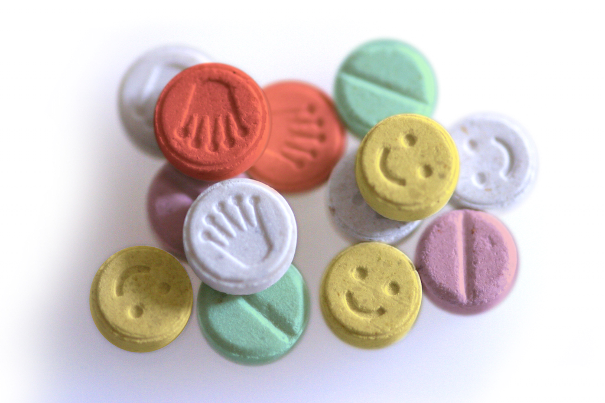
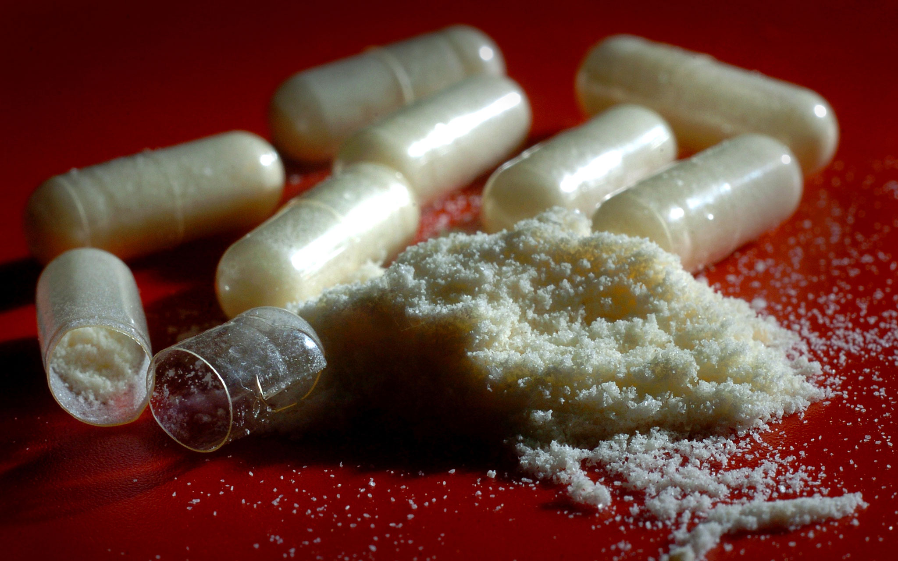
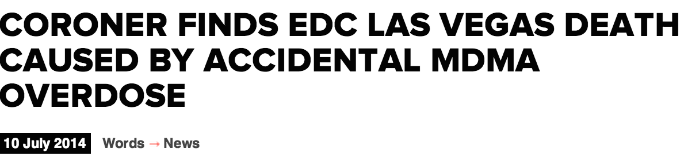
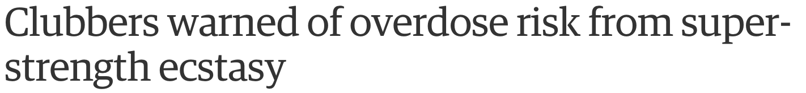
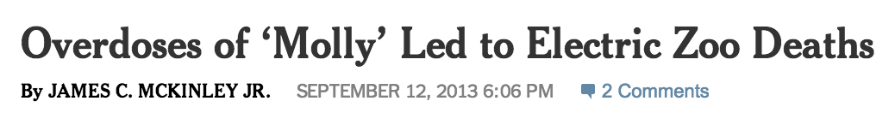

## Our Question

<q>How has the composition of pills sold as ecstasy changed over time?</q>

---

## Outline

* Background
* Data Source
* Getting and Cleaning Data
* Sketches and Visualizations
* TODO

--- .segue .dark

## Background

---

## What is Ecstasy?

> * Any pill represented as MDMA on the street
> * Notoriously unreliable in content and purity
> * Can come in tablet, powder, or crystalline form

---

## Pill Form



---

## Powder Form



---

## Common Effects

> * Positive
	* feelings of comfort, empathy, and connection to others
	* decreased fear, anxiety, and insecurities
	* increased awareness and appreciation of music
> * Negative
	* jaw clenching, teeth grinding, cheek chewing
	* increase in body temperature, dehydration
	* hyponatremia (drinking too much water)
	* post-trip crash

---

## In The News

> * 
> * 
> * 

--- 

## Word on the Street

<q>The mainstream popularity of music festivals and raves has led to an upsurge of "impure" ecstasy pills as demand of MDMA exceeds supply.</q>

--- .segue .dark

## Data Source

---

## Dead End?

> * Data on Schedule I substances is difficult to obtain
> * Very few human studies available
> * Collecting new data was not a reasonable option

---

## EcstasyData.org

> * Independent lab pill testing program
> * Run by [Erowid Center](https://www.erowid.org/) and sponsored by [Dancesafe](http://www.dancesafe.org/)
> * Analyze chemical composition of user-submitted and confiscated pills
> * Publish results [online](http://www.ecstasydata.org/results.php) as a means of harm reduction

---

## Caveats

> * Sample bias
> * Chemical composition presented as ratio, not mass percent
> * Not concerned with therapeutic dose of individual substances

--- .segue .dark

## Getting and Cleaning Data

---

## Data Scraping

* Do everything the dumb way for one year…
	* Played around with the query URL to test the parameters
	
```{r, eval=FALSE}
url <- sprintf("http://www.ecstasydata.org/results_xml.php?sold_as_ecstasy=yes&
Y1=%s&Y2=%s&max=500", year, year)
```

* Obtained raw XML for 2013-2014 using the `XML` package

```{r, eval=FALSE}
raw <- xmlToList(xmlParse(year.params.url))
```

---

## Data Wrangling

* ID and active components
	* Looped through active components using `lapply` and put them in a dataframe
* Active components (list element) were trapped in the columnar format "X:Y"
	* Use `colsplit` to separate composition:proportion

```{r, eval=FALSE}
id.actives <- id.actives[complete.cases(id.actives), ]
id.actives[, 2:3] <- colsplit(id.actives$composition, ":", 
c("composition", "proportion"))
```

---

## Data Wrangling

* ID and attributes (name, location, mass, year)
	* Additional attributes by ID were looped via `lapply` and put in a dataframe
	* `NULL` locations broke `lapply` loop, fixed with an `if(is.null)` statement
	
```{r, eval=FALSE}
if (is.null(raw.data$tablet$location)) {
		raw.data$tablet$location <- "NA"
}
```

---

## Data Wrangling

* Combine actives and attributes by ID
* melt / cast dataframe using reshape2 package

---

## Complete Script (All Years)

* Scrape data for 1999-2014 via functionalization of all previous operations
	* Script would break due to unescaped ampersands (`EntityRef Error`)
* Used `gsub` to substitute entity reference which allowed the script to run

```{r, eval=FALSE}
doc <- getURL(url)
doc <- gsub("&", "&amp;", doc)
```

---
	
## Cleaning

* Combined all yearly datasets into one large, melted dataset
* Removed trailing whitespaces, coerced all non-numeric chars to `NA`

```{r, eval=FALSE}
ecstasy$composition <- gsub(" $","", ecstasy$composition, perl = TRUE)
ecstasy$location <- gsub("\n", "", ecstasy$location)

ecstasy$proportion <- as.numeric(ecstasy$proportion)
```

---

## Cleaning

* Applied bin categorical weights based on normalized composition
	1. Pure MDMA $(=1)$
	2. More MDMA $(\ge 0.5)$
	3. Less MDMA $(< 0.5)$
	4. No MDMA $(=0)$
	5. Unknown

---

## Cleaning
	
```{r, eval=FALSE}
if (!("MDMA" %in% pill$composition)) {
        mdma[i] <- 4 # No MDMA
}
mdma.prop <- pill[pill$composition == "MDMA", "proportion"] / sum(pill$proportion)
if (is.nan(mdma.prop) | is.na(mdma.prop)) {
    mdma[i] <- 5
	} else if (mdma.prop > 0.5 & mdma.prop < 1) {
    	mdma[i] <- 2
	} else if (mdma.prop <= 0.5 & mdma.prop > 0) {
    	mdma[i] <- 3
	} else if (mdma.prop == 1) {
    	mdma[i] <- 1
	} else {
    	mdma[i] <- 5
	}
}
```

--- .segue

## Sketches and Visualizations

---

## Sketches


---

## Sketches

* Simple interactive dotplot
* 3-D visualization of deviations...how to do 4-D? Nah.
* Mini circles in a big circle? Sort of like a pie chart…
* Stacked stream, area, or bar?
* Dunkin’ donuts chart

---

## Visualizations

Static (ggplot)

```{r, eval = FALSE, echo=FALSE, warning=FALSE, message=FALSE, error=FALSE}
library(dplyr)
library(ggplot2)
library(rCharts)

ecstasy <- read.csv("ecstasy.csv", stringsAsFactors=FALSE)

## remove trailing whitespaces
ecstasy$composition <- gsub(" $","", ecstasy$composition, perl = TRUE)
ecstasy$location <- gsub("\n", "", ecstasy$location)
## this coerces all non-numeric characters to NA
ecstasy$proportion <- as.numeric(ecstasy$proportion)


## create categorical variable for mdma proportion in pill
mdma <- vector()
id.vec <- unique(ecstasy$id)
for (i in id.vec) {
    ## subset by pill id
    pill <- ecstasy[ecstasy$id == i, c("composition", "proportion")]
    ## No MDMA
    if (!("MDMA" %in% pill$composition)) {
        mdma[i] <- 4 # No MDMA
        next
    }
    ## calculate MDMA as percentage of total composition
    mdma.prop <- pill[pill$composition == "MDMA", "proportion"] / sum(pill$proportion)
    print(mdma.prop)
    ## 
    if (is.nan(mdma.prop) | is.na(mdma.prop)) {
        mdma[i] <- 5
        next
    } else if (mdma.prop > 0.5 & mdma.prop < 1) {
        mdma[i] <- 2
    } else if (mdma.prop <= 0.5 & mdma.prop > 0) {
        mdma[i] <- 3
    ## pure mdma
    } else if (mdma.prop == 1) {
        mdma[i] <- 1
    } else {
        mdma[i] <- 5
        next
    }
}

mdma <- factor(mdma, labels = c("Pure MDMA", "More MDMA", "Less MDMA", 
                                "No MDMA", "Unknown"))
mdma.df <- data.frame(id = unique(ecstasy$id), 
                      mdma = mdma,
                      year = ecstasy[!duplicated(ecstasy$id), "year"])


mdma.df %>%
    group_by(year, mdma) %>%
    summarise(count = n()) %>%
    mutate(proportion = count / sum(count)) %>%
	# write.csv(file="mdma_prop.csv")

ecstasy %>%
	## remove duplicated id's
	group_by(id, year, location) %>%
	summarise(count = n()) %>%
	## count location by year
	group_by(year, location) %>%
	summarise(count = n()) %>%
	## take top by 5
	arrange(desc(count)) %>%
	top_n(5) %>%
	## write to json
	# write.csv(file="mdma_loc.csv")

mdma.plot.subset <- subset(as.data.frame(mdma.plot), 
                           mdma %in% c("Pure MDMA", "More MDMA", "Less MDMA", "No MDMA"))

ggplot(aes(year, proportion)) +
	geom_area(aes(col = mdma, fill = mdma), position = "stack") +
	scale_fill_brewer(type = "div", palette = 1) +
	theme_classic()
```

---

## Visualizations

Stacked Bar Plot (rCharts)

```{r, eval = FALSE, echo=FALSE, warning=FALSE, message=FALSE, error=FALSE}
n1 <- nPlot(proportion ~ year, group = "mdma", 
            data = mdma.plot.subset, type = "stackedAreaChart")
n1$print("nvd3stacked")
```

---

## Visualizations

Stacked Area Plot with hover-overs (d3)

---

## Visualizations

Slider Dot Plot (d3)


